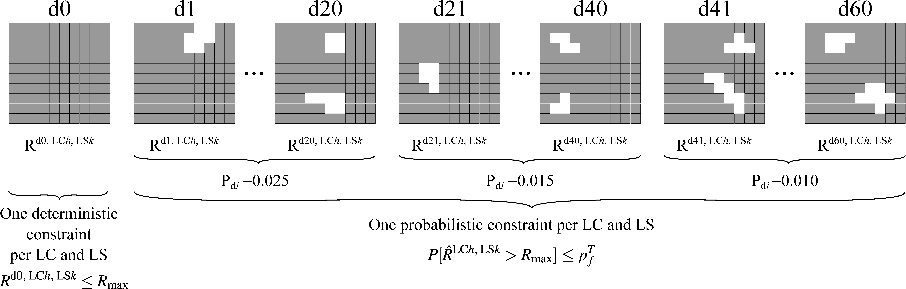
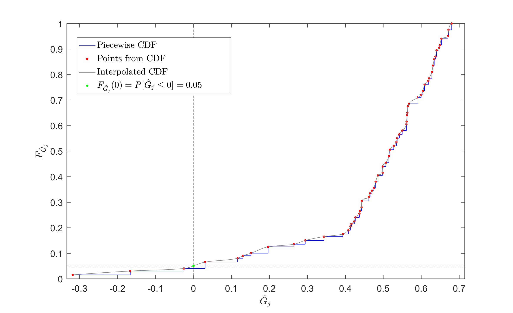

# PDFSO

**P**robability **D**amage approach for **F**ail-**S**afe **O**ptimization

The PDFSO problem is a new approach for fail-safe optimization of structures, which takes into account the available information on the probability of occurrence of different accidental scenarios. The results lead to a less conservative and more appropriate design compared to the traditional fail-safe optimization, as the actual data of each accidental situation are included in the optimization process.

## Example

An intact model and 60 damaged configurations are considered in this example. Two load cases were considered (LC1, LC2), with two limit-states per load case (LS1, LS2). 

The formulation of the optimization problem is presented below:

being  the structural response to be evaluated and 

the maximum value of the response. 
For the implementation of the problem the limit-states has to be formulated in the normalized form as 
, to compute the sensitivity with respect to the 
design variables when performing the optimization algorithm.

The response values are:

For the intact structure, the coefficients of 

take unitary values to simulate the original limit-state.
To simulate the limit-states of the damaged configurations, a matrix 

was randomly generated for each limit-state though a Latin Hypercube Sampling, with coefficients lower than 1. 
This is a way to reproduce the behaviour of a generic structural response, where its value increases due to the lost of structural capacity. 
Each row of the matrix refers to the coefficients 

associated to each damaged configuration.

## How to use it

Edit the `defineInputParameters` function, where the following inputs are defined:

Problem Parameters       | Description
:-----------------       | :----------
d0                       | Initial value of design varaibles
nDV                      | Number of design variables
nDamages                 | Number of damaged configurations
pDamages                 | Probability of occurrence of each damaged configuration
pf                       | Target probability of failure
nLC                      | Number of load cases
nDcon                    | Number of limit-states
resp                     | Response cell  (see below)
respMax                  | Maximum response cell  (see below)
limitStateFun            | Limit state cell (see below)

Optimization Parameters       | Description
:----------------------       | :----------
lb                            | Lower bounds of design variables
ub                            | Upper bounds of design variables
TolCon                        | Constraint tolerance
TolFun                        | Objective function tolerance
DiffMinChange                 | Minimum finite difference step
DiffMaxChange                 | Maximum finite difference step

## Results

The program generates a CFD plot of each probabilistic limit-state

